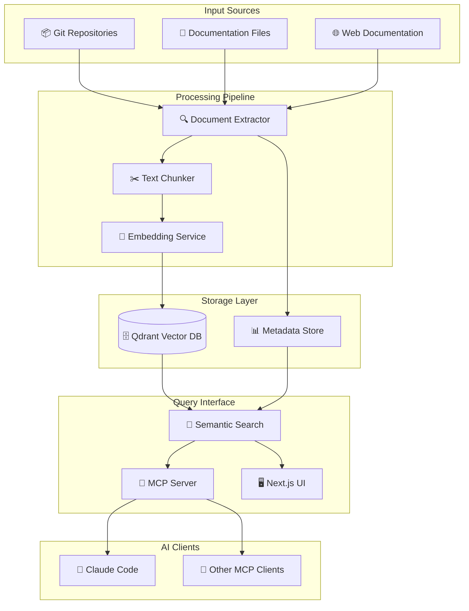
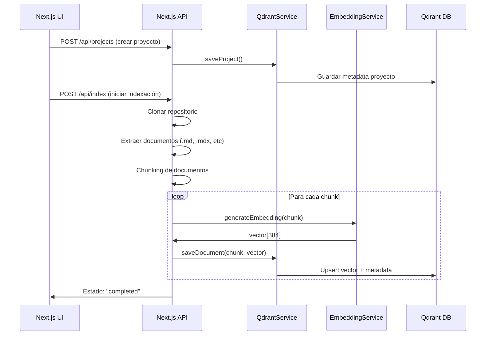
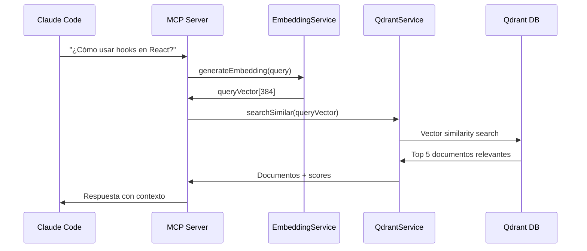

# DAAT Project - Documentation RAG System

Un sistema RAG (Retrieval-Augmented Generation) para indexar documentaciones de proyectos y exponerlas através de un servidor MCP (Model Context Protocol).

## 🏗️ Arquitectura General



## 🎯 Componentes del Sistema

### 1. Next.js Frontend (Puerto 3000)
- **Función**: Interfaz web para gestionar proyectos y ver documentación indexada
- **Responsabilidades**:
  - CRUD de proyectos
  - Visualización de estado de indexación
  - Búsqueda y preview de documentos
  - Dashboard de métricas

### 2. Servidor MCP (Puerto 8000)
- **Función**: Servidor standalone que expone la funcionalidad RAG via MCP
- **Responsabilidades**:
  - Recibir consultas de clientes MCP
  - Ejecutar búsquedas semánticas en Qdrant
  - Retornar documentación relevante
  - Manejar contexto y conversaciones

### 3. Qdrant Vector Database
- **Función**: Almacenamiento de vectores y búsqueda semántica
- **Collections**:
  - `daat`: Documentos vectorizados (embeddings 384D)
  - `projects`: Metadata de proyectos (sin vectores)

### 4. Embedding Service
- **Función**: Convertir texto a vectores numéricos
- **Opciones**:
  - **OpenAI API** (ada-002, text-embedding-3-small)
  - **HuggingFace Transformers** (local)
  - **Ollama** (local, modelos como nomic-embed-text)

## 🔄 Flujo de Datos

### Indexación de Documentos


### Consulta via MCP


## 📊 Estructura de Datos

### Proyecto
```typescript
interface Project {
    id: string;                    // UUID único
    name: string;                  // "Next.js Documentation"
    description?: string;          // Descripción opcional
    url: string;                   // URL del repositorio
    status: 'pending' | 'indexing' | 'completed' | 'error';
    documentsCount: number;        // Cantidad de documentos indexados
    createdAt: Date;
    updatedAt: Date;
    tags?: string[];               // ["react", "frontend", "ssr"]
}
```

### Documento Extraído
```typescript
interface ExtratedDoc {
    projectId: string;             // Referencia al proyecto
    path: string;                  // "docs/getting-started.md"
    title: string;                 // Título extraído del documento
    content: string;               // Contenido del chunk
    metadata?: Record<string, any>; // Headers, frontmatter, etc.
    repoUrl: string;               // URL original del archivo
    filType: string;               // "md", "mdx", "rst", etc.
}
```

### Punto Vectorial en Qdrant
```json
{
    "id": "nextjs-docs-getting-started-chunk-1",
    "vector": [0.1, -0.3, 0.8, ...], // 384 dimensiones
    "payload": {
        "projectId": "uuid-proyecto",
        "title": "Getting Started with Next.js",
        "content": "Next.js is a React framework...",
        "path": "docs/getting-started.md",
        "chunkIndex": 1,
        "metadata": {
            "headers": ["h1", "h2"],
            "wordCount": 150
        }
    }
}
```

## 🛠️ Opciones de Embedding Service

### 1. OpenAI API (Recomendado para producción)
```bash
# Variables de entorno
OPENAI_API_KEY=sk-...
EMBEDDING_MODEL=text-embedding-3-small  # 1536 dims
# o
EMBEDDING_MODEL=text-embedding-ada-002   # 1536 dims
```

**Pros**: Alta calidad, rápido, hosted
**Contras**: Costo por uso, requiere internet

### 2. HuggingFace Local (Recomendado para desarrollo)
```bash
npm install @huggingface/transformers
# Modelo: sentence-transformers/all-MiniLM-L6-v2 (384 dims)
```

**Pros**: Gratuito, offline, privacidad
**Contras**: Consume memoria, setup inicial

### 3. Ollama Local (Alternativa)
```bash
ollama pull nomic-embed-text  # 768 dims
```

**Pros**: Fácil setup, modelos optimizados
**Contras**: Tamaño de modelo, dependencia externa

## 🚀 Plan de Implementación

### Fase 1: RAG Core ✅ (Parcialmente completado)
- [x] Setup Qdrant collections
- [x] Modelos de datos TypeScript
- [x] QdrantService básico
- [ ] Embedding service
- [ ] Document extraction & chunking
- [ ] Vector search functions

### Fase 2: MCP Server
- [ ] Servidor MCP standalone (Node.js)
- [ ] Implementar protocolo MCP
- [ ] Búsqueda semántica via MCP
- [ ] Manejo de contexto y conversaciones

### Fase 3: Next.js Frontend
- [ ] UI para gestión de proyectos
- [ ] Indexación via formularios
- [ ] Visualización de documentos
- [ ] Dashboard de métricas

### Fase 4: Optimizaciones
- [ ] Chunking inteligente (respetando markdown)
- [ ] Filtros por proyecto/tags
- [ ] Caché de embeddings
- [ ] Métricas de relevancia

## 🔧 Comandos de Desarrollo

```bash
# Instalar dependencias
yarn install

# Desarrollo Next.js
yarn dev

# Desarrollo MCP Server (cuando esté implementado)
yarn mcp:dev

# Build completo
yarn build

# Linting
yarn lint
```

## 🌟 Casos de Uso

1. **Consulta Directa**: "¿Cómo configurar routing en Next.js?"
2. **Comparación**: "Diferencias entre getServerSideProps y getStaticProps"
3. **Debugging**: "Error hydration mismatch en Next.js"
4. **Best Practices**: "Optimización de performance en React"

## 📁 Estructura del Proyecto

```
repo-docs-next/
├── app/                    # Next.js App Router
│   ├── api/               # API Routes para indexación
│   └── page.tsx           # UI principal
├── lib/
│   ├── qdrant.ts          # ✅ QdrantService
│   ├── embeddings.ts      # 🔄 Embedding service
│   ├── chunker.ts         # 🔄 Document chunking
│   └── extractor.ts       # 🔄 Git & file extraction
├── mcp-server/            # 🔄 Servidor MCP standalone
│   ├── index.ts           # Entry point MCP
│   └── handlers.ts        # MCP request handlers
├── types/
│   └── index.ts           # ✅ Interfaces TypeScript
└── components/            # ✅ UI Components (shadcn/ui)
```

## 🔒 Consideraciones de Seguridad

- Variables de entorno para API keys
- Validación de URLs de repositorios
- Sanitización de contenido extraído
- Rate limiting en APIs
- Autenticación para MCP server (opcional)

---

**¿Necesitas un servicio de embeddings?** 

**SÍ, es obligatorio.** Sin embeddings no puedes hacer búsqueda semántica. Qdrant necesita vectores numéricos para calcular similitud coseno entre documentos y queries.

**Recomendación**: Empieza con HuggingFace local para desarrollo, migra a OpenAI para producción.