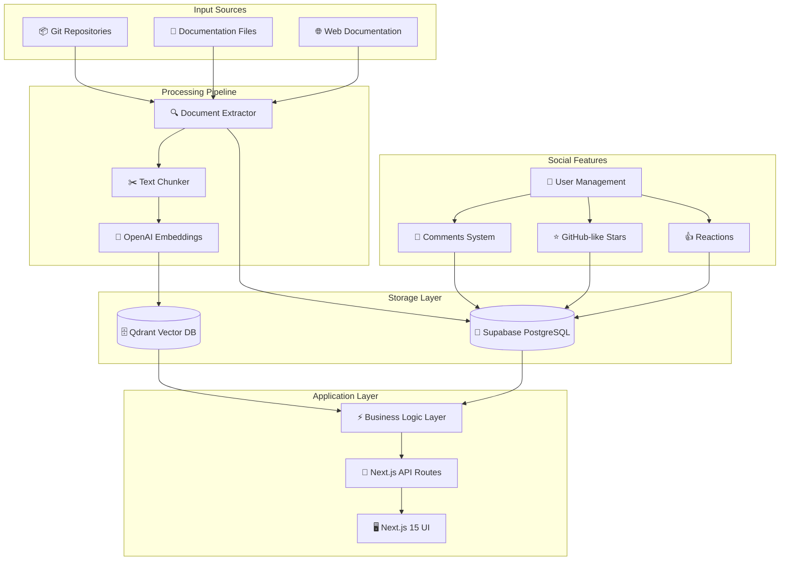
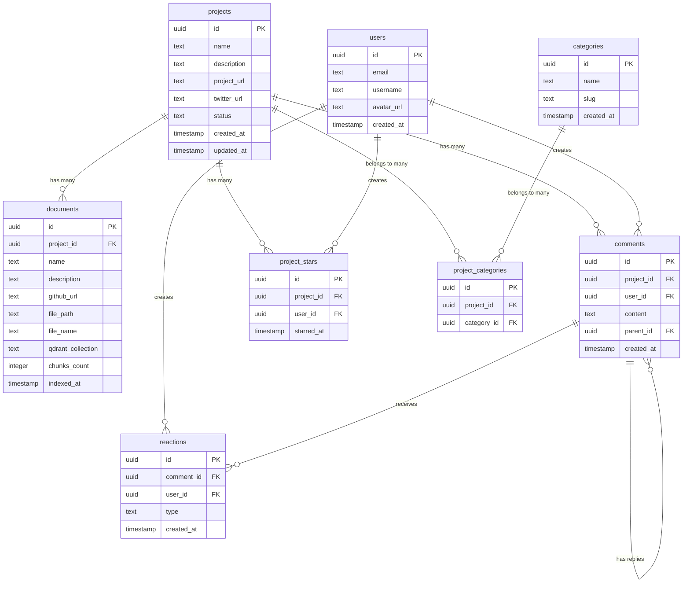
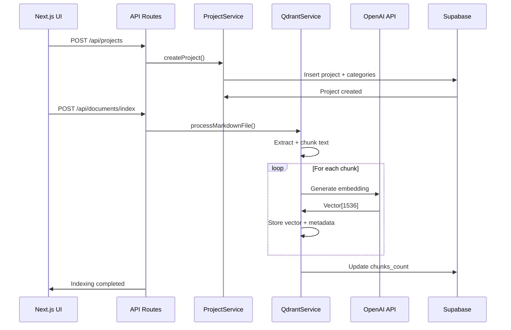
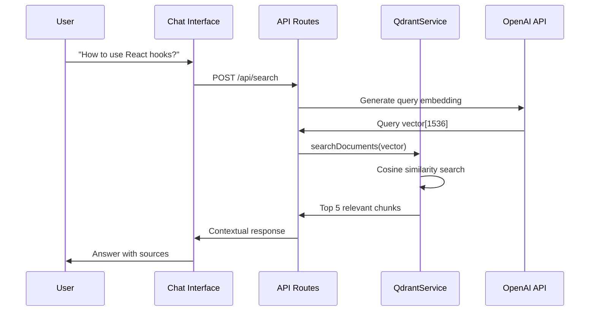

# DAAT Project - Documentation RAG System

A RAG (Retrieval-Augmented Generation) system for indexing project documentation with a GitHub-like social platform for the developer community.

## 🏗️ General Architecture



## 🎯 Tech Stack

### Frontend
- **Next.js 15** - React framework with App Router
- **TypeScript** - Static typing
- **Tailwind CSS** - Utility-first styling
- **shadcn/ui** - Modern UI components
- **Lucide React** - Icon library

### Backend & Database
- **Supabase PostgreSQL** - Relational database
- **Drizzle ORM** - Type-safe ORM for PostgreSQL
- **Qdrant** - Vector database for semantic search
- **OpenAI API** - Embeddings generation (text-embedding-3-small, 1536D)

### Infrastructure
- **Vercel** - Deployment and hosting
- **Docker** - Containerization (Qdrant)

## 🗄️ Database Architecture

### Relational Schema (Supabase)



### Vector Schema (Qdrant)

```json
{
    "collection": "project_<uuid>",
    "vector": [0.1, -0.3, 0.8, ...], // 1536 dimensions
    "payload": {
        "project_id": "uuid-project",
        "document_id": "uuid-document", 
        "title": "Getting Started with React",
        "content": "React is a JavaScript library...",
        "file_path": "docs/getting-started.md",
        "chunk_index": 1,
        "metadata": {
            "headers": ["h1", "h2"],
            "word_count": 150
        }
    }
}
```

## 🔄 Data Flow

### 1. Document Indexing



### 2. Semantic Search



## 🎨 UI/UX Features

### Project Cards
- **Optimized height**: `h-72` for better content visualization
- **Flexible layout**: Adaptive content distribution
- **Social stats**: GitHub-style stars and comments counter
- **External links**: Buttons for Twitter/X and project URL
- **Categories**: Category badges with visual limits
- **Status indicators**: Visual project states

### Social Features
- **GitHub-style stars**: Favorites system for projects
- **Comments system**: Nested comments with replies
- **Reactions**: Like/dislike on comments
- **User profiles**: Basic user management

## 📊 Data Types

### Project with Relations
```typescript
interface ProjectWithRelations extends Project {
  categories: Category[];
  documents: Document[];
  documentsCount: number;
  commentsCount: number;
  starsCount: number;
}
```

### Business Services
```typescript
class ProjectService {
  async getAllProjects(): Promise<ProjectWithRelations[]>
  async getProjectById(id: string): Promise<ProjectWithRelations | null>
  async getProjectsByCategory(slug: string): Promise<Project[]>
}
```

## 🛠️ Development Commands

```bash
# Install dependencies
yarn install

# Next.js development
yarn dev

# Database
yarn db:generate    # Generate migrations
yarn db:push        # Apply schema changes
yarn db:seed        # Populate with initial data

# Linting and formatting
yarn lint
yarn typecheck

# Production build
yarn build
```

## 🗂️ Project Structure

```
repo-docs-next/
├── app/                          # Next.js App Router
│   ├── api/                     # API Routes
│   │   ├── chat/               # Chat functionality
│   │   └── projects/           # Projects CRUD
│   ├── projects/               # Projects pages
│   └── globals.css             # Global styles
├── lib/
│   ├── db/                     # Database layer
│   │   ├── schema.ts          # Drizzle schema
│   │   └── index.ts           # DB connection
│   ├── services/               # Business logic
│   │   └── project.service.ts # Projects service
│   ├── hooks/                  # React hooks
│   │   └── useProjects.ts     # Projects data fetching
│   ├── types/                  # TypeScript types
│   ├── qdrant.ts              # Vector database service
│   └── utils.ts               # Utilities
├── components/                  # React components
│   ├── ui/                    # shadcn/ui components
│   ├── theme-provider.tsx     # Theme management
│   └── theme-toggle.tsx       # Dark mode toggle
├── scripts/
│   └── seed.ts                # Database seeding
└── drizzle/                   # Database migrations
```

## 🌟 Use Cases

### For Developers
1. **Centralized Documentation**: Unified access to docs from multiple projects
2. **Semantic Search**: "How to implement authentication in Next.js?"
3. **Comparisons**: Differences between frameworks or libraries
4. **Community Feedback**: Project comments and ratings

### For Project Maintainers
1. **Visibility**: Project showcase with social metrics
2. **Feedback Loop**: Direct community feedback
3. **Analytics**: Usage and popularity metrics
4. **Documentation as Code**: Automatic indexing from repositories

## 🔧 Environment Configuration

### Required Variables (.env.local)
```bash
# Database
DATABASE_URL="postgresql://..."
DIRECT_URL="postgresql://..."

# OpenAI
OPENAI_API_KEY="sk-..."

# Qdrant
QDRANT_URL="http://localhost:6333"

# Next.js
NEXT_PUBLIC_APP_URL="http://localhost:3000"
```

### External Services
1. **Supabase**: Hosted PostgreSQL database
2. **OpenAI**: High-quality embeddings API
3. **Qdrant Cloud** or **Local Docker**: Vector database

## 🚀 Roadmap

### ✅ Phase 1: Core Infrastructure (Completed)
- [x] Next.js 15 + TypeScript setup
- [x] Supabase + Drizzle ORM integration
- [x] Complete relational schema
- [x] QdrantService with OpenAI embeddings
- [x] Base UI with shadcn/ui
- [x] Projects and categories system

### ✅ Phase 2: Social Features (Completed)
- [x] Users, comments, reactions tables
- [x] GitHub-style stars system
- [x] Project cards with social stats
- [x] External links (Twitter/X, project URL)
- [x] Service layer with business logic

### 🔄 Phase 3: In Development
- [ ] Chat interface for RAG queries
- [ ] MD document indexing from GitHub
- [ ] Functional semantic search
- [ ] Comments system frontend
- [ ] User authentication

### 📅 Phase 4: Future
- [ ] MCP Server for Claude Code integration
- [ ] Analytics dashboard
- [ ] Public API for third parties
- [ ] Mobile-responsive improvements
- [ ] Advanced search filters

## 🤝 Contributing

This project is designed to be extensible and maintainable. Contributions are welcome following established conventions:

- **Database**: Use Drizzle migrations for schema changes
- **API**: RESTful endpoints under `/api`
- **UI**: shadcn/ui components with Tailwind CSS
- **Types**: Strict TypeScript throughout the application

---

**Current Status**: Functional base system with social architecture. Next step: implement complete RAG with chat interface.